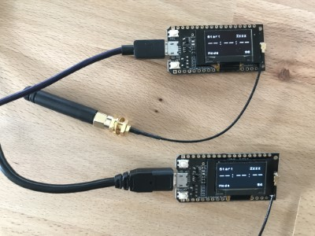
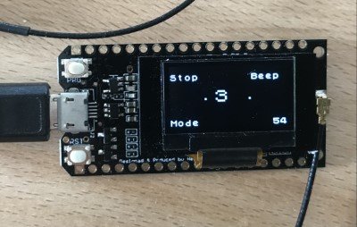
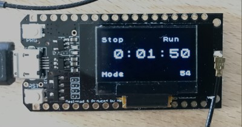
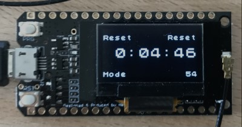

# LoRa-Stopwatch

This is stopwatch is designed for a stadium covering a distance of 100m.
One device is placed at the starting line for the competitors, one at the finish line for the coach.
People at the starting line can hear the countdown beeps, which is also used during competitions.
The person at the finish line does not need to shout a start command or try to guess when the start did occur.

A single unit will act as a normal stopwatch with countdown.
When started, a countdown of six steps will be initiated, playing a beep after each second.

Multiple units will be be triggered from the device, where the physical button has been pressed.
I.e. you can initiate the start on one device and stop on another.

## countdown

## Running

## Reset

## Hardware

Lora modules being used here do have an OLED and are based on the ESP32.
The only thing to be added is a buzzer.
A later version will get an additional button in order to select different operating modes.
