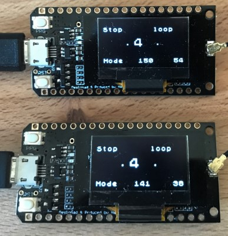
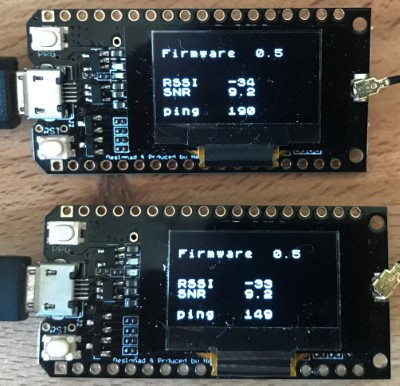
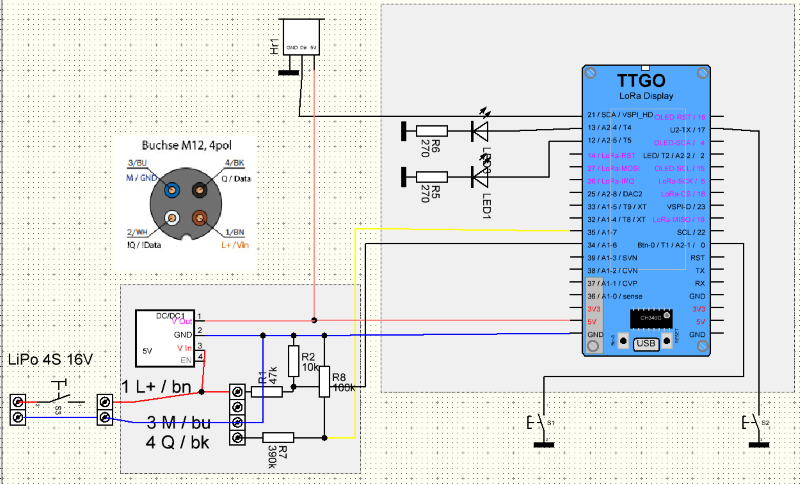

# LoRa-Stopwatch

This is stopwatch is designed for a stadium covering a distance of 100m.
One device is placed at the starting line for the competitors, one at the finish line for the coach.
People at the starting line can hear the countdown beeps, which is also used during competitions.
The person at the finish line does not need to shout a start command or try to guess when the start did occur.

A single unit will act as a normal stopwatch with countdown.
When started, a countdown of six steps will be initiated, playing a beep after each second.

All units are connected via LoRa in order to synchronize them. Actions can be triggered on any device and will be trasnmitted to the other devices. I.e. you can start the stopwatch on one device and stop using nother one.

Despite of manual mode using buttons, a light barrier can be added. In order to trigger the appropriate action the module type can be defined in the setup: basic(manual), start, finish and lap.

A smart phone can connect to the web-server in order to provide a much better UI.

## countdown

## Running

## Reset

## Loop

## Admin

## Hardware

Lora modules being used here do have an OLED and are based on the ESP32. There are chaper LoRa modules but those are based on a ATMega without WLAN.
The only thing to be added is a buzzer and a sensor acting as a light barrier.

### Light Barrier
The stopwatch is using industry sensors based on infrared. A Laser must be limited to class 1 at least in Germany. Most of the cheap modules on eBay are class 2 or 3 and can cause significant damage to the eyes.  
The SICK WL27-2F240 is covering 14m with a simple reflektor. This one has a PNP switching output so a simple voltage divider based on two resistors is needed to shift the voltage for the LoRa module.

### Power Supply
The sensors require 10-30 V. Accordingly you would need a LiPo 3s or 4s battery.
One cell does provide 4.2V when fully charged and 3.8V at storage level.  
A step down converter is providing the 5V for the LoRa module.

### Buzzer
Most of the simple buzzers for arduino are not loud enough. The next test will be using a buzzer from Matek.

## Circuit Diagram

